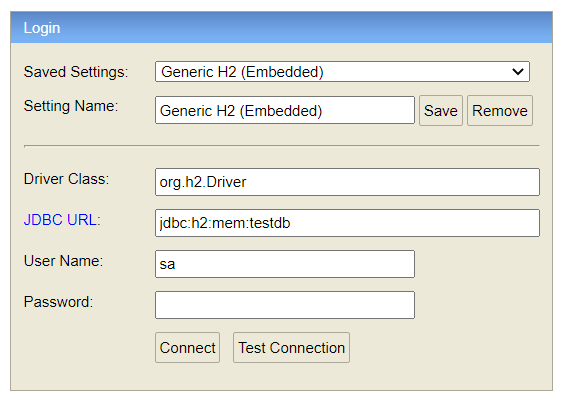
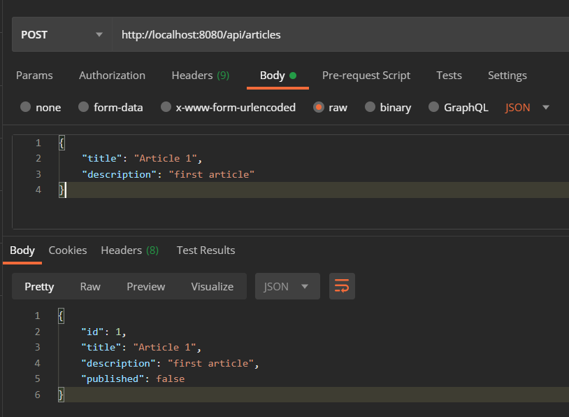

# Spring Data JPA example

###### Requirements

You will need Java, Maven and browser to run this project. 
To run server, go into the main folder and run: 

`mvn spring-boot:run`

articles will be automatically generated in the database. 
Let’s open H2 console with url: `http://localhost:8080/h2-ui`

Then set following settings: 

Then let's create some Articles:

Alternatively, you can user CURL to perform CRUD operations.  
Example commands:  
`curl --header "Content-Type: application/json" --request POST --data "{\"title\": \"Article 1\", \"description\": \"this is the first article\"}" http://localhost:8080/api/articles`

`curl --request GET http://localhost:8080/api/articles`

`curl --request GET http://localhost:8080/api/articles/1`

`curl --request DELETE http://localhost:8080/api/articles/1`

`curl --header "Content-Type: application/json" --request PUT --data "{\"title\": \"New title\", \"description\": \"new description\", \"published\": \"true\"}" http://localhost:8080/api/articles/3`